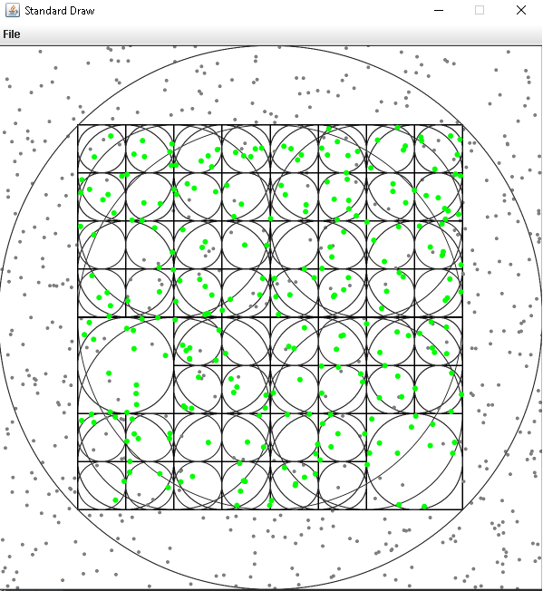

# octree

### Task: to implement a modified Octree algorithm.                                                               
* The algorithm must build a standard octree, but embed a sphere in each of the octree's cubes.                 
* All the points within a sphere should further be subdivided into eight cubes (with spheres inside).           
* All the points that are outside the sphere can be discarded. Visualize the results.

### Project using JDK v18 and StdDraw class from stdDraw2D library.

* Pull project from GitHub into your IDE tool(Eclipse, IntelliJ or other).                                      
* Build and run Octree/src/Application.java

#### You will get 2D model of 3D octree object,                                                                    
#### with a set of randomly generated 3D coordinates inside the sphere and a created octree.

